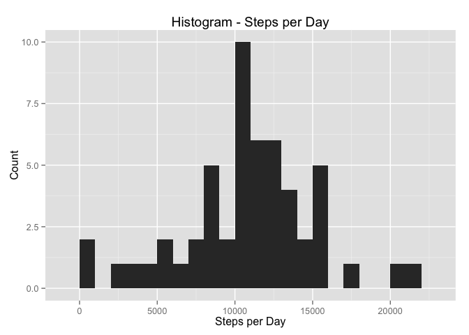
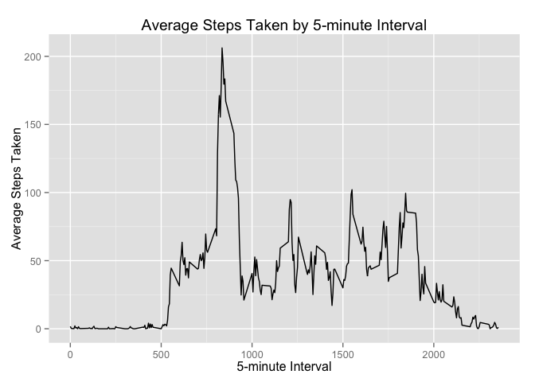
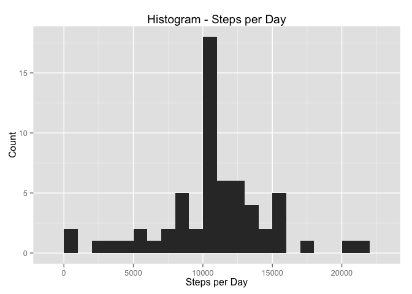
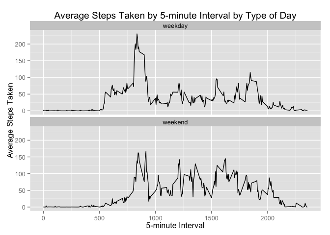

# Reproducible Research: Peer Assessment 1

### Loading Necessary Libraries

Before we start our analysis it is important to load the necessary libraries, we're going to use `dplyr` to clean our data and `ggplot2` to build our graphs.


```r
library(dplyr)
library(ggplot2)
library(knitr)
```

### Set up global chunk options

```r
opts_chunk$set(cache=TRUE, fig.align = "center")
```

### Loading and preprocessing the data

First we are going to unzip our data and then read the lines.

```r
unzip("activity.zip")
data <- read.csv("activity.csv", sep = ",", colClasses = c("numeric", "Date", "numeric")) 
```

### What is mean total number of steps taken per day?

The first question we are going to answer is about the mean number of steps taken per day. To do this analysis we grouped our data by date and then summed up the steps. 
To show it we build a histogram to see how our data is distributed.


```r
steps_per_day <- group_by(data, date) %>%
    summarise(steps_per_day = sum(steps))

ggplot(steps_per_day, aes(x = steps_per_day)) + 
    geom_histogram(binwidth=1000) +
    xlab("Steps per Day") +
    ylab("Count") +
    ggtitle("Histogram - Steps per Day")
```


Just a few numbers, our mean here is 1.077\times 10^{4} and our median is 1.076\times 10^{4}.

### What is the average daily activity pattern?

To answer the second question we are going to group our data by interval, and then plot the average for each interval. 


```r
daily_activity <- group_by(data, interval) %>%
    summarise(daily_activity = mean(steps, na.rm=T))

ggplot(daily_activity, aes(x = interval, y = daily_activity)) +
    geom_line() +
    xlab("5-minute Interval") +
    ylab("Average Steps Taken") +
    ggtitle("Average Steps Taken by 5-minute Interval")
```



```r
max_step <- filter(daily_activity, daily_activity == max(daily_activity$daily_activity))
```
Also, the interval with the maximum number of steps was the 835 with  steps. 

### Imputing missing values

If we check our data we can see that we have some missing values in the steps measures. 
We are going to replace our missing values with the mean for the corresponding interval. 
We are going to call the data without the missing values as `new_data`.

```r
number_na <- length(which(is.na(data$steps)))

missing_data <- is.na(data$steps) 
new_data <- data

new_data$steps[missing_data] <- sapply(new_data$interval[missing_data], function(d){
    daily_activity$daily_activity[daily_activity$interval == d]
})
```

Before we can compare the `new_data` with our `data` it is important to know that we've replaced 2304 missing values.

Now, we are going to build the same histogram from Question 1 but with the new data, with that we can see how the distribution has changed.

```r
new_steps_per_day <- group_by(new_data, date) %>%
    summarise(steps_per_day = sum(steps))

ggplot(new_steps_per_day, aes(x = steps_per_day)) + 
    geom_histogram(binwidth=1000) +
    xlab("Steps per Day") +
    ylab("Count") +
    ggtitle("Histogram - Steps per Day")
```


Just some more comparisions, after replacing the missing values the new mean is 1.077\times 10^{4} and the new median is 1.077\times 10^{4}. As we can see the median is a little higher and is the same as the mean. 

### Are there differences in activity patterns between weekdays and weekends?

To check if there are differences between weekdays and weekends we've created a factor vector in the same sequence as our `new_data` is, that is what made possible to create a new column with the values `weekday` and `weekend`. 
With our new data we build the same plot in question 2, but now with two panels, each one for the type of day.

```r
weekday <- sapply(new_data$date, function(d) {
    ifelse(weekdays(d) %in% c("Monday", "Tuesday", "Wednesday", "Thursday", "Friday"), "weekday", "weekend")
})
weekday <- as.factor(weekday)

new_data <- mutate(new_data, weekday = weekday)

new_daily_activity <- group_by(new_data, interval, weekday) %>%
    summarise(daily_activity = mean(steps, na.rm=T))

ggplot(new_daily_activity, aes(x = interval, y = daily_activity)) +
    geom_line() +
    facet_wrap(~ weekday, nrow=2) +
    xlab("5-minute Interval") +
    ylab("Average Steps Taken") +
    ggtitle("Average Steps Taken by 5-minute Interval by Type of Day")
```


With those graphs we can see that there is a slightly difference between the number of steps taken during weekdays and weekends.
